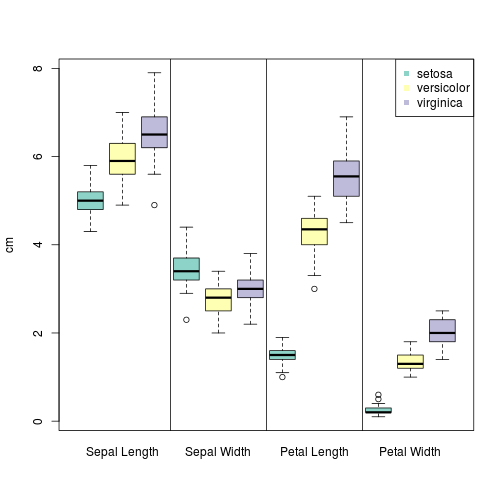

Simple GLM predictors of Iris species
========================================================
author: Patrice Godard
date: 2014-11-19

<small>
- Project in the frame of the coursera
<a href="https://class.coursera.org/devdataprod-007">"Developing Data Products"</a>
- The data product as such is available <a href="https://pgodard.shinyapps.io/irisGlmPred/">here</a>
</small>

Iris flower data set (Fisher's Iris data set)
========================================================


<small>
Information taken from <a href="http://en.wikipedia.org/wiki/Iris_flower_data_set">wikipedia</a>
- A multivariate data set introduced by Sir Ronald Fisher (1936)
- Edgar Anderson collected the data to quantify the morphologic variation of Iris flowers of three related species:
  - Iris setosa (50 samples)
  - Iris virginica (50 samples)
  - Iris versicolor (50 samples)
- Four features were measured from each sample, in centimetres (cm)
  - Width and length of sepals
  - Width and length of petals
</small>

Feature distribution
========================================================

 

The aim of the project
========================================================
Assess the performance of simple generalized linear models (<acronym title="Generalized Linear Model">GLM</acronym>) based on a single feature using the following R function:

```r
## feature %in% colnames(iris)
glm(
	formula = feature ~ Species,
	data = iris,
	family = binomial
)
```
The glm call above uses the following logit link function:
$$X\beta = ln\left(\frac{\mu}{1 - \mu}\right)$$

Accuracy of the predictors
========================================================

- Sepal length

	- Iris setosa: 0.94
	- Iris versicolor: 0.38
	- Iris virginica: 0.82
		
- Sepal width

	- Iris setosa: 0.76
	- Iris versicolor: 0.68
	- Iris virginica: 0.32
		
***
- Petal length

	- Iris setosa: 1
	- Iris versicolor: 0.92
	- Iris virginica: 0.94
	
- Petal width

	- Iris setosa: 1
	- Iris versicolor: 0.9
	- Iris virginica: 0.94
